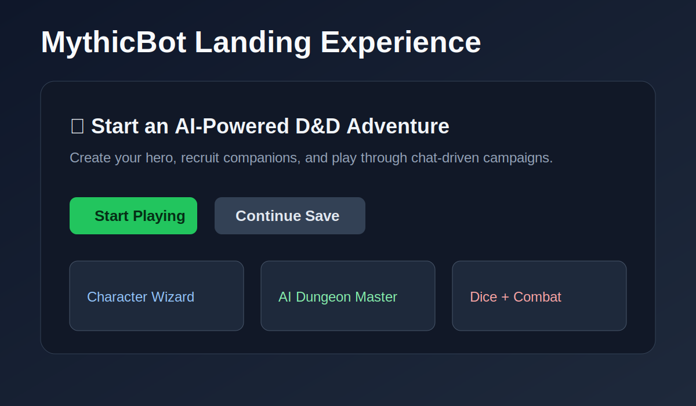
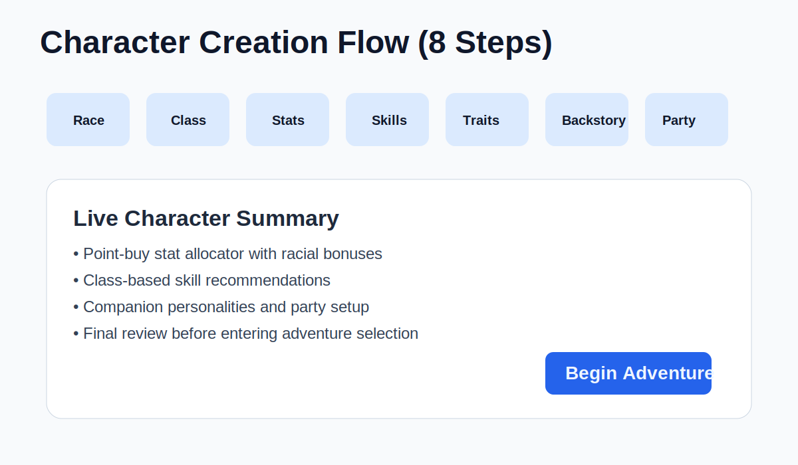
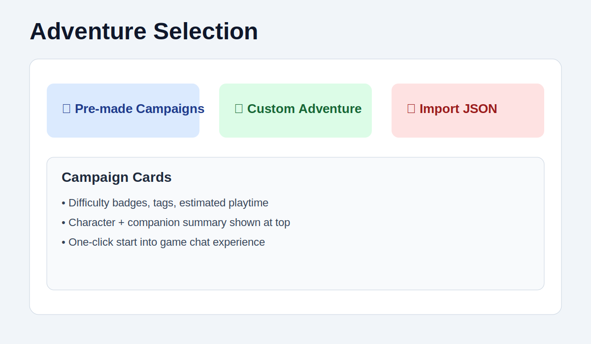
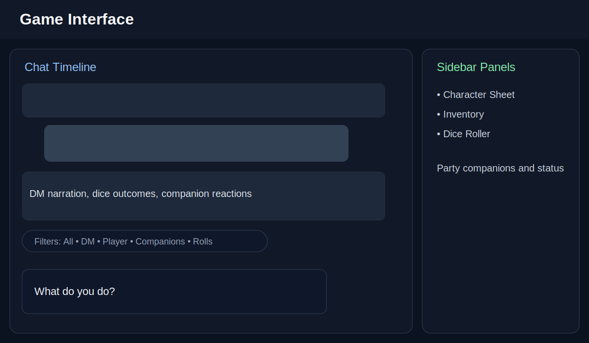

# 🐉 MythicBot

**An AI-Powered D&D Adventure Companion**

MythicBot is a modern, minimalist web application that brings tabletop role-playing games to life. Create characters, form parties with AI companions, and embark on epic adventures—all powered by intelligent dungeon mastering that follows authentic D&D 5e rules.


---

## ✨ Features

### 🧙 Character Creation
- **8-Step Character Wizard** - Guided creation with race, class, stats, skills, personality, background, and companions
- **6 Playable Races** - Human, Elf, Dwarf, Halfling, Tiefling, Dragonborn (each with unique stat bonuses)
- **6 Character Classes** - Fighter, Wizard, Rogue, Cleric, Ranger, Bard (each with unique abilities)
- **Point-Buy Stats** - Allocate 27 points across 6 abilities with race bonuses
- **Skill Selection** - Choose proficiencies based on your class
- **Party Companions** - Create up to 3 AI companions with unique personalities

### 🎲 Authentic D&D Experience
- **Proper Roll Mechanics** - Follows D&D 5e rules for when rolls are required
- **Manual Dice Interaction** - The DM asks *you* to roll when the stakes are high
- **Ability Checks** - Strength, Dexterity, Constitution, Intelligence, Wisdom, Charisma
- **Attack Rolls** - Combat with AC and hit determination
- **Critical Success/Failure** - Natural 20s and 1s with special effects
- **Difficulty Class (DC)** - Dynamic difficulty based on situation
- **Ability Modifiers** - Your stats actually affect your rolls!

### 💬 Immersive Chat Interface
- **AI Dungeon Master** - Contextual narration and story progression
- **Companion Chat Bubbles** - Each companion speaks with their own personality
- **Companion Agency** - Companions can take risks and roll for their own actions!
- **8 Personality Types** - Cheerful, Stoic, Sarcastic, Wise, Impulsive, Cautious, Grumpy, Mischievous
- **Quick Actions** - Common actions at your fingertips
- **Interactive Dice** - Click to roll d20 directly in chat

### 🎯 Animated Dice System
- **Visual Dice Rolling** - Animated SVG dice with spinning effects
- **Color-Coded Dice** - d4 through d20, each with unique colors
- **Roll History** - Track your past rolls
- **Critical Indicators** - Special effects for nat 20s 🎉 and nat 1s 💀

### 📚 Pre-Made Adventures
- **The Lost Temple of Shadows** - Classic dungeon crawl
- **Dragon's Lair** - Face the ultimate challenge
- **City of Whispers** - Urban intrigue and mystery
- **Custom Adventures** - Create or import your own

### 🎮 Game Features
- **Character Sheet** - View stats, HP, and abilities in real-time
- **Inventory System** - Track items and equipment
- **Sidebar Dice Roller** - Roll any die type anytime
- **Auto-Save** - Progress saved to localStorage
- **Responsive Design** - Works on desktop and mobile

---


## 🖼️ App Preview

### Landing Page


### Character Creation Wizard


### Adventure Selection


### In-Game Interface


These visuals show the main user journey: launch the app, build a hero, pick an adventure, and play through the chat-first game interface.

---

## 🚀 Quick Start

### Prerequisites
- Node.js 18+ 
- npm or yarn

### Installation

```bash
# Clone the repository
git clone https://github.com/MarcosN7/MythicBot.git

# Navigate to project directory
cd MythicBot

# Install dependencies
npm install

# Start development server
npm run dev
```

Open your browser to `http://localhost:5173` and begin your adventure!

### Build for Production

```bash
npm run build
npm run preview
```

---

## 🧪 Testing

MythicBot includes both unit and component tests to ensure stability.

### Running Tests

**Unit Tests** (Node.js native runner):
```bash
npm test
```
Runs logic tests for game rules, storage, and API services.

**Component Tests** (Vitest + React Testing Library):
```bash
npx vitest run
```
Runs UI tests for components like `ChatInterface` and `GameInterface`.

---

## 🏗️ Project Structure

```
mythicbot/
├── src/
│   ├── components/
│   │   ├── character/      # Character creation wizard steps
│   │   ├── common/         # Reusable UI components (Button, Card, Input, Modal)
│   │   └── game/           # Game interface components
│   │       ├── AnimatedDice.jsx    # Dice animations
│   │       ├── ChatInterface.jsx   # Main chat with DM/companions
│   │       ├── CharacterSheet.jsx  # Character stats display
│   │       ├── DiceRoller.jsx      # Sidebar dice roller
│   │       ├── Inventory.jsx       # Item management
│   │       └── SettingsModal.jsx   # Game settings
│   ├── context/
│   │   └── GameContext.jsx # Global state management
│   ├── data/
│   │   ├── adventures.js   # Pre-made adventure data
│   │   ├── classes.js      # Character class definitions
│   │   ├── races.js        # Race stat bonuses
│   │   └── skills.js       # Skill proficiencies
│   ├── pages/
│   │   ├── LandingPage.jsx
│   │   ├── CharacterCreator.jsx
│   │   ├── AdventureSelection.jsx
│   │   └── GameInterface.jsx
│   ├── services/
│   │   ├── aiService.js    # AI/DM response generation
│   │   └── storage.js      # localStorage utilities
│   └── App.jsx             # Main app with routing
├── index.html
├── tailwind.config.js
└── vite.config.js
```

---

## 🤖 AI Integration Guide

MythicBot is designed with AI integration in mind. Currently, it uses a mock AI service that simulates DM responses. Here's how to connect real AI providers:

### Google Gemini Integration

1. **Get API Key** from [Google AI Studio](https://makersuite.google.com/app/apikey)

2. **Install the SDK**:
```bash
npm install @google/generative-ai
```

3. **Update `aiService.js`**:
```javascript
import { GoogleGenerativeAI } from "@google/generative-ai";

const genAI = new GoogleGenerativeAI(import.meta.env.VITE_GEMINI_API_KEY);
const model = genAI.getGenerativeModel({ model: "gemini-1.5-flash" });

export const generateDMResponse = async (context) => {
  const { character, companions, previousTurns, action } = context;
  
  const prompt = `You are a Dungeon Master for a D&D 5e game.
  
Character: ${character.name}, a ${character.race} ${character.class}
Stats: STR ${character.stats.strength}, DEX ${character.stats.dexterity}, etc.
Companions: ${companions.map(c => `${c.name} (${c.race} ${c.class})`).join(', ')}

Previous context: ${previousTurns.slice(-5).map(t => t.text).join('\n')}

The player says: "${action}"

Respond as a D&D Dungeon Master. Follow these rules:
- Only call for dice rolls when there's meaningful uncertainty
- Use proper D&D mechanics (ability checks, attack rolls, saving throws)
- Include companion reactions when appropriate
- Keep responses concise but immersive`;

  const result = await model.generateContent(prompt);
  const response = await result.response;
  
  return {
    success: true,
    message: response.text(),
    companionResponses: [], // Parse from response if needed
    metadata: { timestamp: new Date().toISOString() }
  };
};
```

4. **Add environment variable**:
```bash
# .env.local
VITE_GEMINI_API_KEY=your_api_key_here
```

### OpenAI GPT Integration

1. **Get API Key** from [OpenAI Platform](https://platform.openai.com/api-keys)

2. **Install the SDK**:
```bash
npm install openai
```

3. **Update `aiService.js`**:
```javascript
import OpenAI from 'openai';

const openai = new OpenAI({
  apiKey: import.meta.env.VITE_OPENAI_API_KEY,
  dangerouslyAllowBrowser: true // For client-side use
});

export const generateDMResponse = async (context) => {
  const { character, companions, previousTurns, action } = context;
  
  const systemPrompt = `You are a skilled Dungeon Master for D&D 5e.
Follow proper D&D rules for dice rolls and ability checks.
Be immersive but concise. Include companion reactions.`;

  const messages = [
    { role: "system", content: systemPrompt },
    ...previousTurns.slice(-10).map(turn => ({
      role: turn.type === 'user' ? 'user' : 'assistant',
      content: turn.text
    })),
    { role: "user", content: action }
  ];

  const completion = await openai.chat.completions.create({
    model: "gpt-4o-mini",
    messages: messages,
    temperature: 0.8,
    max_tokens: 500
  });

  return {
    success: true,
    message: completion.choices[0].message.content,
    companionResponses: [],
    metadata: { timestamp: new Date().toISOString() }
  };
};
```

4. **Add environment variable**:
```bash
# .env.local
VITE_OPENAI_API_KEY=your_api_key_here
```

### Security Note ⚠️

For production use, **never expose API keys in client-side code**. Instead:
- Use a backend proxy server (Node.js, Express, etc.)
- Store API keys in server environment variables
- Make API calls from your backend, not the browser

---

## 🎨 Customization

### Adding New Races

Edit `src/data/races.js`:
```javascript
{
  id: 'orc',
  name: 'Orc',
  description: 'Fierce warriors with unmatched strength',
  statBonuses: { strength: 2, constitution: 1 },
  traits: ['Aggressive', 'Powerful Build', 'Menacing'],
  size: 'Medium',
  speed: 30
}
```

### Adding New Classes

Edit `src/data/classes.js`:
```javascript
{
  id: 'paladin',
  name: 'Paladin',
  description: 'Holy warrior bound by sacred oaths',
  hitDie: 10,
  primaryAbility: 'strength',
  savingThrows: ['wisdom', 'charisma'],
  skillOptions: ['athletics', 'insight', 'intimidation', 'medicine', 'persuasion', 'religion'],
  abilities: ['Divine Sense', 'Lay on Hands', 'Divine Smite']
}
```

### Adding Adventures

Edit `src/data/adventures.js`:
```javascript
{
  id: 'your-adventure',
  name: 'Your Epic Quest',
  description: 'An original adventure',
  difficulty: 'Medium',
  setting: 'Custom Setting',
  openingNarrative: 'Your adventure begins...',
  hooks: ['Starting situation', 'Initial conflict', 'First choice']
}
```

---

## 🛠️ Tech Stack

- **React 18** - UI framework with hooks
- **Vite 6** - Fast build tool and dev server
- **Tailwind CSS 3** - Utility-first styling
- **React Router 7** - Client-side routing
- **React Context** - Global state management
- **localStorage** - Client-side persistence

---

## 📝 D&D Rules Reference

### Roll Types
| Type | When Used | Dice |
|------|-----------|------|
| Ability Check | Uncertain tasks (climb, persuade, sneak) | d20 + modifier |
| Attack Roll | Hitting a target in combat | d20 + modifier vs AC |
| Saving Throw | Resisting spells, traps, effects | d20 + modifier vs DC |
| Damage Roll | Dealing damage on hit | varies (d4-d12) |

### When NOT to Roll
- Trivial tasks (walking, talking, looking around)
- Impossible actions (no roll makes miracles)
- Automatic successes (well within character ability)

---

## 🤝 Contributing

Contributions are welcome! Please feel free to submit a Pull Request.

1. Fork the repository
2. Create your feature branch (`git checkout -b feature/AmazingFeature`)
3. Commit your changes (`git commit -m 'Add some AmazingFeature'`)
4. Push to the branch (`git push origin feature/AmazingFeature`)
5. Open a Pull Request

---

## 📄 License

This project is licensed under the MIT License - see the [LICENSE](LICENSE) file for details.

---

## 🙏 Acknowledgments

- Dungeons & Dragons 5th Edition by Wizards of the Coast
- React and Vite communities
- All the tabletop RPG enthusiasts who inspired this project

---

<div align="center">

**Roll for initiative and begin your adventure!** 🎲⚔️🐉

Made with ❤️ by [MarcosN7](https://github.com/MarcosN7)

</div>
